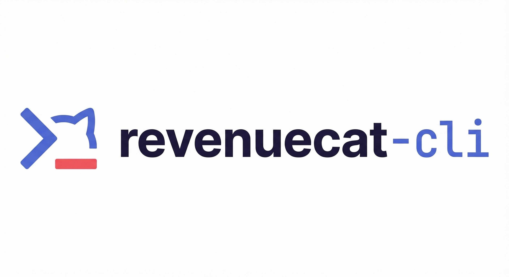

<div align="center">



# RevenueCat CLI

### Manage in-app subscriptions from your terminal

[](https://github.com/AndroidPoet/revenuecat-cli/releases/latest)
[](https://github.com/AndroidPoet/revenuecat-cli/releases)
[](https://go.dev)
[](LICENSE)

**No dashboard. No clicking. Just subscriptions.**

```bash
rc entitlements create --lookup-key premium --display-name "Premium Access"
```

[Install](#-installation) · [Quick Start](#-quick-start) · [Commands](#-commands) · [CI/CD](#-cicd-integration)

</div>

---

## Why RC CLI

| The Old Way | The RC Way |
|-------------|------------|
| Open dashboard, navigate menus, wait... | `rc apps list` |
| Create products through UI one by one | `rc products create --store-identifier com.app.sub` |
| Manually attach products to entitlements | `rc entitlements attach-products --product-ids id1,id2` |
| Complex setup for CI/CD automation | Single binary + `RC_API_KEY` env var |
| "Did someone change the offering?" | `rc offerings list -o table` |

---

## Installation

```bash
# Homebrew (recommended)
brew tap AndroidPoet/tap && brew install revenuecat-cli

# Install script (Linux/macOS)
curl -fsSL https://raw.githubusercontent.com/AndroidPoet/revenuecat-cli/main/install.sh | bash

# Build from source
git clone https://github.com/AndroidPoet/revenuecat-cli.git
cd revenuecat-cli && make build
```

After install, you can use either `revenuecat-cli` or the shorter alias `rc`.

---

## Quick Start

**1. Get your API key** from [RevenueCat Dashboard → API Keys](https://app.revenuecat.com/settings/api-keys)

Create a **v2 secret key** with appropriate permissions.

**2. Configure**
```bash
rc auth login --api-key sk_your_secret_key_here
```

**3. Set your project**
```bash
rc init --project proj_your_project_id
# Or use the flag: rc apps list --project proj_xxx
# Or set the env: export RC_PROJECT=proj_xxx
```

**4. Start managing subscriptions!**
```bash
rc apps list                          # See your apps
rc entitlements list                  # View entitlements
rc offerings list -o table            # Offerings in table format
rc doctor                             # Verify everything works
```

---

## Commands

**11 command groups, 34 subcommands.**

### Apps

```bash
rc apps list                                           # List all apps
rc apps get --app-id app_xxx                           # App details
rc apps create --name "My App" --type play_store       # Create app
rc apps update --app-id app_xxx --name "New Name"      # Update app
rc apps delete --app-id app_xxx --confirm              # Delete app
rc apps api-keys --app-id app_xxx                      # List public API keys
```

### Products

```bash
rc products list                                       # List all products
rc products create --store-identifier com.app.monthly \
  --type subscription --app-id app_xxx                 # Create product
```

### Entitlements

```bash
rc entitlements list                                   # List all entitlements
rc entitlements get --entitlement-id entl_xxx           # Get details
rc entitlements create --lookup-key premium \
  --display-name "Premium"                             # Create entitlement
rc entitlements update --entitlement-id entl_xxx \
  --display-name "Premium+"                            # Update
rc entitlements delete --entitlement-id entl_xxx \
  --confirm                                            # Delete
rc entitlements list-products \
  --entitlement-id entl_xxx                            # List attached products
rc entitlements attach-products \
  --entitlement-id entl_xxx --product-ids prod1,prod2  # Attach products
rc entitlements detach-products \
  --entitlement-id entl_xxx --product-ids prod1        # Detach products
```

### Offerings

```bash
rc offerings list                                      # List all offerings
rc offerings create --lookup-key default \
  --display-name "Default Offering"                    # Create offering
rc offerings update --offering-id ofrngs_xxx \
  --is-current                                         # Set as current
```

### Packages

```bash
rc packages list --offering-id ofrngs_xxx              # List packages
rc packages create --offering-id ofrngs_xxx \
  --lookup-key monthly --display-name "Monthly"        # Create package
rc packages attach-products \
  --package-id pkg_xxx --product-ids prod1,prod2       # Attach products
rc packages detach-products \
  --package-id pkg_xxx --product-ids prod1             # Detach products
```

### Customers

```bash
rc customers get --customer-id cust_xxx                # Get customer info
rc customers delete --customer-id cust_xxx --confirm   # Delete customer
```

### Paywalls

```bash
rc paywalls create --offering-id ofrngs_xxx            # Create paywall
```

### Utilities

```bash
rc doctor                                              # Validate setup
rc init --project proj_xxx                             # Create .rc.yaml config
rc completion zsh > "${fpath[1]}/_rc"                  # Shell completions
rc version                                             # Version info
```

---

## CI/CD Integration

### GitHub Actions

```yaml
name: Configure RevenueCat

on:
  push:
    branches: [main]

jobs:
  setup:
    runs-on: ubuntu-latest
    steps:
      - uses: actions/checkout@v4

      - name: Install RC CLI
        run: |
          curl -fsSL https://raw.githubusercontent.com/AndroidPoet/revenuecat-cli/main/install.sh | bash
          echo "$HOME/.local/bin" >> $GITHUB_PATH

      - name: Create Products
        env:
          RC_API_KEY: ${{ secrets.REVENUECAT_API_KEY }}
          RC_PROJECT: ${{ secrets.REVENUECAT_PROJECT_ID }}
        run: |
          rc products create --store-identifier com.app.monthly --type subscription --app-id $APP_ID
          rc entitlements create --lookup-key premium --display-name "Premium"
          rc entitlements attach-products --entitlement-id $ENT_ID --product-ids $PROD_ID
```

---

## Environment Variables

| Variable | Description |
|----------|-------------|
| `RC_API_KEY` | RevenueCat API v2 secret key |
| `RC_PROJECT` | Default project ID |
| `RC_PROFILE` | Auth profile to use |
| `RC_OUTPUT` | Format: `json` \| `table` \| `tsv` \| `csv` \| `yaml` |
| `RC_DEBUG` | Show API requests/responses |
| `RC_TIMEOUT` | Request timeout (default: 60s) |

---

## Output Formats

```bash
rc apps list                    # JSON (default, for scripting)
rc apps list --pretty           # Pretty JSON
rc apps list -o table           # ASCII table
rc apps list -o tsv             # Tab-separated values
rc apps list -o csv             # Comma-separated values
rc apps list -o yaml            # YAML
rc apps list -o minimal         # First field only (piping)
```

---

## Pagination

All list commands support pagination:

```bash
rc products list --limit 50                           # 50 results per page
rc products list --starting-after prod_xxx            # Next page
rc products list --all                                # Fetch everything
```

---

## Security

- API keys stored with `0600` permissions
- Keys are masked in `rc doctor` output
- Debug mode redacts Authorization header values
- No secrets in command history (use env vars in CI)

---

## Contributing

PRs welcome! Please open an issue first to discuss major changes.

```bash
make build    # Build
make test     # Test
make lint     # Lint
```

---

## License

MIT

---

<div align="center">

**[Back to top](#-revenuecat-cli)**

<sub>Not affiliated with RevenueCat Inc. RevenueCat is a trademark of RevenueCat Inc.</sub>

### If RC CLI saved you time, [give it a star](https://github.com/AndroidPoet/revenuecat-cli/stargazers)

</div>
